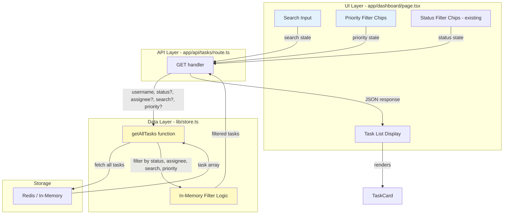
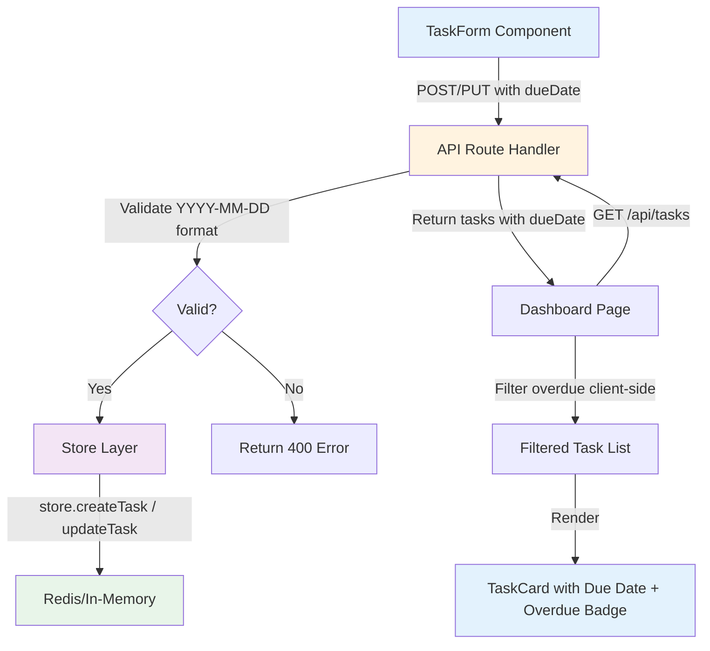

# Architecture — KT-12: Task Search and Advanced Filtering

**Generated:** 2026-08-03  
**Agent:** 02 - Architecture Agent  
**SDLC Stage:** 2 of 8

---

## Section 1 — High-Level Architecture Overview

### 1. Jira Story

**Key:** KT-12  
**URL:** https://bharathwaj1390.atlassian.net/browse/KT-12  
**Summary:** Task Search and Advanced Filtering — Enable keyword search (title/description) and priority filtering, combinable with existing status/assignee filters.

---

### 2. System Architecture

This feature extends the existing **Next.js App Router** task filtering architecture by adding two new query parameters to `GET /api/tasks`:
- `?search=<term>` — case-insensitive substring match on title and description
- `?priority=<low|medium|high>` — exact match on priority field

**Architecture Pattern:** Server-side filtering (in-memory) with client-side UI state management.

**Key Design Decision:** All filtering logic remains in `lib/store.ts` (`getAllTasks` function). The API route handler extracts query params and passes them to the store layer. This preserves the existing data layer boundary and keeps filtering logic centralized.

**No New Dependencies:** This feature uses existing in-memory array filtering (`.filter()` method). No search libraries, caching layers, or database indexes are introduced.

---

### 3. Component Diagram



**Legend:**
- **Blue** — New UI components (search input, priority filter)
- **Yellow** — Modified data layer logic
- **White** — Existing components (no changes)

---

### 4. Key Components and Responsibilities

| Component | Current Role | Change Required | Reason |
|-----------|--------------|-----------------|--------|
| **app/dashboard/page.tsx** | Display tasks, handle status/assignee filters | Add search input + priority filter UI; update `fetchTasks` to include new query params | User needs controls for search and priority filtering |
| **app/api/tasks/route.ts** | Handle GET/POST requests; extract status/assignee query params | Extract `search` and `priority` query params; validate priority value | API contract expansion per FR-01, FR-02 |
| **lib/store.ts** | Data persistence and filtering (status, assignee) | Extend `getAllTasks` signature to accept `search` and `priority` params; add filtering logic | Centralized filtering logic |
| **lib/types.ts** | TypeScript interfaces | No changes | Task schema unchanged; priority field already exists |
| **components/TaskCard.tsx** | Display task details | No changes | UI already displays priority badge |
| **components/TaskForm.tsx** | Create/edit task form | No changes | Priority field already exists in form |

---

### 5. Data Flow

**User Action: Search for "login" with Priority = High and Status = To Do**

1. **User enters "login" in search input** → React state `searchTerm = "login"`
2. **User selects Priority = "High" chip** → React state `priorityFilter = "high"`
3. **User clicks Status = "To Do" chip** → React state `statusFilter = "todo"`
4. **Dashboard triggers `fetchTasks()`** with debounce (300ms for search)
5. **API request sent:** `GET /api/tasks?status=todo&priority=high&search=login`
6. **API route handler (`route.ts`):**
   - Extracts query params: `status="todo"`, `priority="high"`, `search="login"`
   - Validates `priority` value (must be low/medium/high or undefined)
   - Calls `store.getAllTasks(username, status, assignee, search, priority)`
7. **Store layer (`lib/store.ts`):**
   - Fetches all tasks for user from Redis/in-memory
   - Applies filters in sequence:
     - Status filter: `tasks.filter(t => t.status === "todo")`
     - Priority filter: `tasks.filter(t => t.priority === "high")`
     - Search filter: `tasks.filter(t => t.title.toLowerCase().includes("login") || t.description.toLowerCase().includes("login"))`
   - Returns filtered task array
8. **API returns:** `{ data: [{ id: "t1", title: "Design login page", ... }] }`
9. **Dashboard renders:** `TaskCard` components for matching tasks
10. **Empty state shown** if result array is empty (FR-07)

---

## Section 2 — Implementation Details

### 6. Impacted Files

| File Path | Change Type | Reason |
|-----------|-------------|--------|
| `app/api/tasks/route.ts` | **Modify** — GET handler | Extract and validate `search` and `priority` query params |
| `lib/store.ts` | **Modify** — `getAllTasks` function | Add search and priority filtering logic |
| `app/dashboard/page.tsx` | **Modify** — UI and state | Add search input, priority filter chips, update fetch logic |
| `lib/types.ts` | **No change** | Task interface already has `priority` field; no new fields added |
| `components/TaskCard.tsx` | **No change** | Already displays priority badge |
| `components/TaskForm.tsx` | **No change** | Already has priority dropdown |

**Total files changed:** 3  
**Total new files:** 0  
**Total tests impacted:** 0 (existing tests pass; new tests added separately)

---

### 7. Data Model Changes

**No data model changes required.** The `Task` interface already includes all necessary fields:

```typescript
export interface Task {
  id: string;
  title: string;
  description: string;
  status: TaskStatus;  // "todo" | "in-progress" | "done"
  priority: TaskPriority;  // "low" | "medium" | "high" ← already exists
  assignee: string;
  createdAt: string;
  updatedAt: string;
  dueDate?: string;  // optional field from KT-11
}
```

**Rationale:** Priority is an existing required field. Search operates on `title` and `description` (also existing). No schema evolution needed.

---

### 8. API Contract Changes

#### **GET /api/tasks** (Modified)

**New Query Parameters:**

| Parameter | Type | Required | Validation | Description |
|-----------|------|----------|------------|-------------|
| `search` | string | No | Max 200 chars | Case-insensitive substring search on title and description |
| `priority` | string | No | Must be "low", "medium", or "high" | Exact match on priority field |

**Existing Parameters (Unchanged):**

| Parameter | Type | Required | Validation | Description |
|-----------|------|----------|------------|-------------|
| `status` | string | No | Must be "todo", "in-progress", or "done" | Exact match on status field |
| `assignee` | string | No | Any string | Exact match on assignee field |

**Request Examples:**

```http
GET /api/tasks?search=login
GET /api/tasks?priority=high
GET /api/tasks?status=todo&priority=high&search=api
GET /api/tasks?search=design&assignee=admin
```

**Response (Success — 200 OK):**

```json
{
  "data": [
    {
      "id": "t1",
      "title": "Design login page",
      "description": "Create wireframes and implement the login UI",
      "status": "done",
      "priority": "high",
      "assignee": "admin",
      "createdAt": "2024-01-01T09:00:00Z",
      "updatedAt": "2024-01-02T10:00:00Z"
    }
  ]
}
```

**Response (Empty Result — 200 OK):**

```json
{
  "data": []
}
```

**Response (Invalid Priority — 400 Bad Request):**

```json
{
  "error": "Invalid priority value. Must be low, medium, or high"
}
```

**Response (Search Term Too Long — 400 Bad Request):**

```json
{
  "error": "Search term too long. Maximum 200 characters allowed"
}
```

**Validation Implementation in API Route Handler:**

```typescript
// In app/api/tasks/route.ts GET handler
export async function GET(req: NextRequest) {
  const username = await getUsername(req);
  if (!username) {
    return NextResponse.json({ error: "Unauthorized" }, { status: 401 });
  }

  const { searchParams } = new URL(req.url);
  const status = searchParams.get("status") ?? undefined;
  const assignee = searchParams.get("assignee") ?? undefined;
  
  // Validate search term length (NFR-03)
  const search = searchParams.get("search") ?? undefined;
  if (search && search.length > 200) {
    return NextResponse.json(
      { error: "Search term too long. Maximum 200 characters allowed" },
      { status: 400 }
    );
  }
  
  // Validate priority value
  const priority = searchParams.get("priority") ?? undefined;
  if (priority && !["low", "medium", "high"].includes(priority)) {
    return NextResponse.json(
      { error: "Invalid priority value. Must be low, medium, or high" },
      { status: 400 }
    );
  }

  const tasks = await store.getAllTasks(username, status, assignee, search, priority);
  return NextResponse.json({ data: tasks });
}
```

**Backward Compatibility:**
- Omitting `search` and `priority` params returns all tasks (existing behavior)
- Existing clients unaffected
- Response shape unchanged (`{ data: Task[] }`)

---

### 9. Store Logic Changes

**File:** `lib/store.ts`  
**Function:** `getAllTasks`

**Current Signature:**
```typescript
async function getAllTasks(username: string, status?: string, assignee?: string): Promise<Task[]>
```

**New Signature:**
```typescript
async function getAllTasks(
  username: string, 
  status?: string, 
  assignee?: string, 
  search?: string, 
  priority?: string
): Promise<Task[]>
```

**Implementation Logic:**

```typescript
async function getAllTasks(
  username: string, 
  status?: string, 
  assignee?: string, 
  search?: string, 
  priority?: string
): Promise<Task[]> {
  let tasks = USE_KV ? await kvGetTasks(username) : memUserTasks(username);
  
  // Existing filters (unchanged)
  if (status) {
    tasks = tasks.filter((t) => t.status === status);
  }
  if (assignee) {
    tasks = tasks.filter((t) => t.assignee === assignee);
  }
  
  // New filters
  if (priority) {
    tasks = tasks.filter((t) => t.priority === priority);
  }
  if (search) {
    const searchLower = search.toLowerCase();
    tasks = tasks.filter((t) => 
      t.title.toLowerCase().includes(searchLower) ||
      t.description.toLowerCase().includes(searchLower)
    );
  }
  
  return tasks;
}
```

**Performance Consideration:** Filters are applied sequentially on in-memory arrays. For task counts < 100, this is O(n) per filter, acceptable per NFR-01 (< 500ms response time).

---

### 10. UI Changes

#### **File:** `app/dashboard/page.tsx`

**New State Variables:**

```typescript
const [searchTerm, setSearchTerm] = useState("");
const [priorityFilter, setPriorityFilter] = useState<"all" | TaskPriority>("all");
```

**New UI Components:**

1. **Search Input** (above task list, next to filter chips)
   ```tsx
   <input
     type="text"
     placeholder="Search tasks..."
     value={searchTerm}
     onChange={(e) => setSearchTerm(e.target.value)}
     data-testid="search-input"
     className="border border-gray-300 rounded-lg px-3 py-1.5 text-sm w-64"
   />
   ```

2. **Priority Filter Chips** (next to status filter chips)
   ```tsx
   <div className="flex gap-2" data-testid="priority-filter">
     {["all", "low", "medium", "high"].map((p) => (
       <button
         key={p}
         onClick={() => setPriorityFilter(p as "all" | TaskPriority)}
         data-testid={`filter-priority-${p}`}
         className={/* active/inactive styles */}
       >
         {p === "all" ? "All" : capitalize(p)}
       </button>
     ))}
   </div>
   ```

**Modified `fetchTasks` Function:**

```typescript
const fetchTasks = useCallback(async () => {
  setLoading(true);
  setError("");
  
  // Build query string with all active filters
  const params = new URLSearchParams();
  if (filter !== "all" && filter !== "overdue") params.set("status", filter);
  if (priorityFilter !== "all") params.set("priority", priorityFilter);
  if (searchTerm.trim()) params.set("search", searchTerm.trim());
  
  const url = `/api/tasks?${params.toString()}`;
  
  const res = await fetch(url, {
    headers: { Authorization: `Bearer ${token}` },
  });
  if (res.status === 401) {
    router.push("/");
    return;
  }
  const json = await res.json();
  setTasks(json.data ?? []);
  setLoading(false);
}, [filter, priorityFilter, searchTerm, token, router]);
```

**Debounce for Search Input (Prevents Race Conditions):**

```typescript
// Debounce search input only (300ms delay)
useEffect(() => {
  const timer = setTimeout(() => {
    fetchTasks();
  }, 300);
  return () => clearTimeout(timer);
}, [searchTerm]);

// Immediate fetch for filter changes (no debounce)
useEffect(() => {
  fetchTasks();
}, [priorityFilter, filter]);
```

**Rationale:** Separating the effects prevents race conditions. If a user types "api" (starts 300ms timer) then immediately clicks a priority filter, the priority change triggers an immediate fetch, and the search timer is cleared. When the timer expires, it triggers another fetch with the current state (which now includes both search and priority).

**Empty State Update (FR-07):**

```tsx
{tasks.length === 0 && !loading && (
  <div data-testid="empty-state" className="text-center py-12">
    <p className="text-gray-500">
      {searchTerm || priorityFilter !== "all" || filter !== "all"
        ? "No tasks match the selected filters. Try adjusting your search or filters."
        : "No tasks yet. Click 'Add Task' to create one."}
    </p>
  </div>
)}
```

---

## Section 3 — Risk and Rollback

### 11. Technology Choices

**No new dependencies required.** All features use existing Next.js, React, and JavaScript primitives:
- Search: JavaScript `.toLowerCase()` + `.includes()`
- Priority filter: JavaScript `.filter()` with equality check
- Debounce: React `useEffect` + `setTimeout`

**Rationale:** For the current task volume (< 100 tasks per user), native array filtering is sufficient. No need for Fuse.js, ElasticSearch, or other search libraries.

---

### 12. Backward Compatibility

| Concern | Mitigation | Verification |
|---------|------------|--------------|
| **API Contract** | New query params are optional; omitting them preserves existing behavior | Manual testing: `GET /api/tasks` without params returns all tasks |
| **Data Model** | No schema changes; all fields already exist | Seed tasks unchanged; existing tasks render correctly |
| **UI Selectors** | New `data-testid` attributes added; existing ones unchanged | Manual test cases TC-01 to TC-29 pass without modification |
| **Store Function Signature** | Optional params appended to end of signature; existing callers unaffected (TypeScript allows omission of trailing optional params) | TypeScript compilation succeeds; no breaking changes to API routes |

**Explicit Backward Compatibility Statement:**
- ✅ Existing API clients calling `GET /api/tasks` without new params receive identical responses
- ✅ Existing task data unchanged (no migration required)
- ✅ Existing UI tests (manual test cases) pass without modification
- ✅ No changes to authentication, task schema, or error responses

---

### 13. Rollback Strategy

**If this feature must be reverted:**

1. **Revert `lib/store.ts`:**
   - Remove `search` and `priority` parameters from `getAllTasks` signature
   - Remove search and priority filter logic from function body
   - Git revert: `git revert <commit-hash>`

2. **Revert `app/api/tasks/route.ts`:**
   - Remove `searchParams.get("search")` and `searchParams.get("priority")` lines
   - Remove priority validation logic
   - Remove parameters from `store.getAllTasks()` call

3. **Revert `app/dashboard/page.tsx`:**
   - Remove `searchTerm` and `priorityFilter` state variables
   - Remove search input and priority filter chip components
   - Restore original `fetchTasks` implementation (no search/priority params)

**Impact of Rollback:**
- ✅ No data loss — all tasks remain intact
- ✅ No API breaking changes — existing clients continue to work
- ✅ UI returns to previous state (status + assignee filters only)

**Time to Rollback:** < 10 minutes (3 file changes + deploy)

---

## Summary

This architecture adds **keyword search** and **priority filtering** to the Task Manager with minimal changes to the existing codebase:

- **3 files modified** (API route, store, dashboard) — no new files
- **No data model changes** — all required fields already exist
- **100% backward compatible** — optional query params, no breaking changes
- **No new dependencies** — uses native JavaScript filtering
- **Performance target met** — < 500ms response time for < 100 tasks

**Key Design Principles Applied:**
- ✅ Separation of concerns (UI → API → Store → Data)
- ✅ Single Responsibility (filtering logic centralized in store layer)
- ✅ Open/Closed (extended `getAllTasks` without modifying existing filters)
- ✅ Backward Compatibility (optional params, no breaking changes)

**Ready for Stage 3 (Design Review).**

**Generated:** 2026-07-01  
**Agent:** 02 - Architecture Agent  
**SDLC Stage:** 2 of 8

---

## Section 1 — High-Level Architecture Overview

### 1. Jira Story

**Key:** KT-11  
**URL:** https://bharathwaj1390.atlassian.net/browse/KT-11  
**Summary:** KT-CAPSTONE: Task Due Dates and Overdue Tracking

---

### 2. System Architecture

This feature adds **optional due date tracking** to the existing Next.js App Router architecture. The implementation follows the established patterns:

- **Data Model** — Add optional `dueDate?: string` field to the `Task` interface in `lib/types.ts`
- **Store Layer** — No changes required; the store already handles arbitrary task properties via spread operators
- **API Routes** — Extend `POST /api/tasks` and `PUT /api/tasks/:id` to accept and validate the optional `dueDate` field
- **UI Components** — Extend `TaskForm.tsx` to capture due dates, `TaskCard.tsx` to display them with overdue indicators, and `page.tsx` (dashboard) to add an "Overdue" filter

**Key Design Decision:** Client-side filtering for "Overdue" tasks (no new API query parameter) to minimize backend changes while meeting all functional requirements.

---

### 3. Component Diagram



**Legend:**
- 🔵 Blue — UI Components (modified)
- 🟠 Orange — API Layer (modified)
- 🟣 Purple — Store Layer (unchanged)
- 🟢 Green — Data Store (unchanged)

---

### 4. Key Components and Responsibilities

| Component | Current Role | Change Required | Reason |
|-----------|--------------|-----------------|--------|
| `lib/types.ts` | TypeScript type definitions | Add `dueDate?: string` to `Task` interface | Define optional field in data model |
| `lib/store.ts` | Data persistence (Redis + in-memory) | **No changes needed** | Store already handles extra fields via spread operators |
| `app/api/tasks/route.ts` | Handle `GET /api/tasks` and `POST /api/tasks` | Add `dueDate` validation in POST handler | Accept and validate `dueDate` on create |
| `app/api/tasks/[id]/route.ts` | Handle `GET/PUT/DELETE /api/tasks/:id` | Add `dueDate` validation in PUT handler | Accept and validate `dueDate` on update |
| `components/TaskForm.tsx` | Task create/edit modal form | Add date input field | Capture `dueDate` from user |
| `components/TaskCard.tsx` | Task display card | Add due date display + overdue badge | Show due date and overdue indicator |
| `app/dashboard/page.tsx` | Dashboard with task list + filters | Add "Overdue" filter button + client-side filter logic | Filter overdue tasks on demand |

---

### 5. Data Flow

**User creates/edits a task with a due date:**

1. User opens `TaskForm` modal (create or edit mode)
2. User enters or selects a date in the new "Due Date" input field (HTML5 `<input type="date">`)
3. Form submits to `POST /api/tasks` (create) or `PUT /api/tasks/:id` (edit) with `dueDate: "YYYY-MM-DD"` or `dueDate: null`
4. API route validates the `dueDate` format using regex `/^\d{4}-\d{2}-\d{2}$/`
5. If invalid → return `400 Bad Request` with error message
6. If valid or `null` → pass to `store.createTask()` or `store.updateTask()`
7. Store persists task to Redis (production) or in-memory (local dev) with the `dueDate` field
8. API returns the created/updated task including `dueDate`
9. Dashboard refreshes via `fetchTasks()` and re-renders task list

**User views tasks with due dates:**

10. Dashboard calls `GET /api/tasks` (optionally with `?status=` filter)
11. API returns all tasks, each with `dueDate` field (string or `null`)
12. Dashboard renders each task using `TaskCard`
13. `TaskCard` checks if `dueDate` exists:
    - If `dueDate` is set → display formatted date ("Due: Dec 31, 2026")
    - If `dueDate` is in the past AND `status !== "done"` → show red "OVERDUE" badge
    - If `dueDate` is `null` → no due date display

**User filters overdue tasks:**

14. User clicks "Overdue" filter button on dashboard
15. Dashboard filters the local `tasks` array client-side:
    - Include tasks where `dueDate < today` AND `status !== "done"`
16. Only overdue tasks are rendered
17. User clicks "All" → full list restored

---

## Section 2 — Implementation Details

### 6. Impacted Files

| File Path | Change Type | Reason |
|-----------|-------------|--------|
| `lib/types.ts` | Modify | Add optional `dueDate?: string` field to `Task` interface |
| `lib/utils.ts` | Create | Add shared date utility functions (DRY principle) |
| `app/api/tasks/route.ts` | Modify | Validate and accept `dueDate` in POST handler |
| `app/api/tasks/[id]/route.ts` | Modify | Validate and accept `dueDate` in PUT handler |
| `components/TaskForm.tsx` | Modify | Add date input field for `dueDate` |
| `components/TaskCard.tsx` | Modify | Display due date and overdue indicator |
| `app/dashboard/page.tsx` | Modify | Add "Overdue" filter button and client-side filtering logic |

**Files NOT changed:**
- `lib/store.ts` — No changes needed (store methods already handle extra fields)
- Seed tasks `t1`–`t5` remain unchanged (no `dueDate` field added)

---

### 7. Data Model Changes

**File:** `lib/types.ts`

**Change:** Add optional `dueDate` field to `Task` interface.

```typescript
export interface Task {
  id: string;
  title: string;
  description: string;
  status: TaskStatus;
  priority: TaskPriority;
  assignee: string;
  createdAt: string;
  updatedAt: string;
  dueDate?: string;  // NEW: Optional ISO date string (YYYY-MM-DD)
}
```

**Rationale:**
- Optional field (`?:`) ensures backward compatibility — existing tasks without `dueDate` work unchanged
- Type is `string` (not `Date`) to align with API JSON format and Redis storage
- Format is ISO 8601 date-only (`YYYY-MM-DD`) — time component not included per requirements

---

### 8. API Contract Changes

#### 8.1 POST /api/tasks (Create Task)

**Request body (new optional field):**
```json
{
  "title": "Implement feature X",
  "description": "Build the UI components",
  "status": "todo",
  "priority": "high",
  "assignee": "admin",
  "dueDate": "2026-12-31"  // NEW: Optional, YYYY-MM-DD format or null
}
```

**Response (201 Created):**
```json
{
  "data": {
    "id": "uuid-here",
    "title": "Implement feature X",
    "description": "Build the UI components",
    "status": "todo",
    "priority": "high",
    "assignee": "admin",
    "createdAt": "2026-07-01T10:30:00Z",
    "updatedAt": "2026-07-01T10:30:00Z",
    "dueDate": "2026-12-31"  // NEW: Included in response
  },
  "message": "Task created"
}
```

**Validation rules:**
- `dueDate` is optional — can be omitted, `null`, or a valid date string
- If provided and not `null`, must match `/^\d{4}-\d{2}-\d{2}$/` (YYYY-MM-DD)
- Invalid format → `400 Bad Request` with `{ "error": "dueDate must be in YYYY-MM-DD format" }`
- **Date validity check:** After regex passes, verify the date is actually valid by parsing it and comparing the result to the input string. This catches invalid dates like `2026-02-30` or `2026-13-01`.

```typescript
// Additional validation after regex check
if (dueDate && dueDate !== null) {
  const dateRegex = /^\d{4}-\d{2}-\d{2}$/;
  if (!dateRegex.test(dueDate)) {
    return NextResponse.json(
      { error: "dueDate must be in YYYY-MM-DD format" }, 
      { status: 400 }
    );
  }
  
  // Check if date is actually valid
  const date = new Date(dueDate + "T00:00:00");
  if (isNaN(date.getTime()) || date.toISOString().split("T")[0] !== dueDate) {
    return NextResponse.json(
      { error: "dueDate is not a valid date" }, 
      { status: 400 }
    );
  }
}
```

---

#### 8.2 PUT /api/tasks/:id (Update Task)

**Request body (new optional field):**
```json
{
  "dueDate": "2027-01-15"  // NEW: Optional — can update, set to null, or omit
}
```

**Behavior:**
- If `dueDate: "YYYY-MM-DD"` → update the due date
- If `dueDate: null` → clear the due date
- If `dueDate` omitted → existing due date unchanged

**Validation:** Same as POST (format check if value is not `null`)

---

#### 8.3 GET /api/tasks and GET /api/tasks/:id

**Response change:** All task objects now include `dueDate` field.

```json
{
  "data": [
    {
      "id": "t1",
      "title": "Design login page",
      "status": "done",
      "priority": "high",
      "assignee": "admin",
      "createdAt": "2024-01-01T09:00:00Z",
      "updatedAt": "2024-01-02T10:00:00Z",
      "dueDate": null  // NEW: null for tasks without a due date
    },
    {
      "id": "uuid-123",
      "title": "New task with due date",
      "status": "todo",
      "priority": "medium",
      "assignee": "user1",
      "createdAt": "2026-07-01T10:00:00Z",
      "updatedAt": "2026-07-01T10:00:00Z",
      "dueDate": "2026-12-31"  // NEW: Date string for tasks with a due date
    }
  ]
}
```

**No breaking changes:**
- Existing fields unchanged
- Existing API paths unchanged
- New field is optional — clients can ignore it

---

### 9. Store Logic Changes

**File:** `lib/store.ts`

**Change:** **NONE**

**Rationale:** The store methods already use spread operators to persist all task properties:

```typescript
// createTask (line ~139)
const task: Task = {
  ...data,  // <-- Accepts any fields from input, including dueDate
  id: randomUUID(),
  createdAt: new Date().toISOString(),
  updatedAt: new Date().toISOString(),
};
tasks.push(task);

// updateTask (line ~148)
tasks[index] = { 
  ...tasks[index], 
  ...data,  // <-- Merges any fields from input, including dueDate
  updatedAt: new Date().toISOString() 
};
```

Since `dueDate` is part of the `Task` type and passed in the `data` parameter, it will be automatically persisted without code changes.

---

### 10. UI Changes

#### 10.1 TaskForm.tsx (Create/Edit Form)

**Change:** Add date input field for `dueDate`.

**New state:**
```typescript
const [dueDate, setDueDate] = useState<string>(initial?.dueDate ?? "");
```

**New input field (insert after "Assignee" field, before error message):**
```tsx
<div>
  <label className="block text-sm font-medium mb-1" htmlFor="task-duedate">
    Due Date
  </label>
  <input
    id="task-duedate"
    data-testid="task-duedate-input"
    type="date"
    value={dueDate}
    onChange={(e) => setDueDate(e.target.value)}
    className="w-full border border-gray-300 rounded-lg px-3 py-2 text-sm focus:outline-none focus:ring-2 focus:ring-blue-500"
  />
</div>
```

**Update `handleSubmit` to include `dueDate`:**
```typescript
await onSubmit({ 
  title, 
  description, 
  status, 
  priority, 
  assignee, 
  dueDate: dueDate || null  // Send null if empty string
});
```

**`data-testid` attribute:** `task-duedate-input` (for test automation)

---

#### 10.2 TaskCard.tsx (Task Display)

**Change:** Display due date and overdue indicator.

**Add helper function (top of file, after existing color maps):**
```typescript
import { isTaskOverdue } from "@/lib/utils";

function formatDueDate(dueDate: string): string {
  try {
    const date = new Date(dueDate + "T00:00:00");
    if (isNaN(date.getTime())) {
      return dueDate;  // Fallback: show raw string if parse fails
    }
    return date.toLocaleDateString("en-US", { 
      year: "numeric", 
      month: "short", 
      day: "numeric" 
    }); // Output: "Dec 31, 2026"
  } catch {
    return dueDate;  // Fallback: show raw string on exception
  }
}
```

**Add display logic (insert after description paragraph, before badges):**
```tsx
{task.dueDate && (
  <div className="flex items-center gap-2 mb-3">
    <span className="text-xs text-gray-600" data-testid="task-duedate">
      Due: {formatDueDate(task.dueDate)}
    </span>
    {isTaskOverdue(task.dueDate, task.status) && (
      <span 
        className="text-xs font-bold px-2 py-0.5 rounded bg-red-600 text-white"
        data-testid="task-overdue-badge"
      >
        OVERDUE
      </span>
    )}
  </div>
)}
```

**`data-testid` attributes:**
- `task-duedate` — displays the formatted due date
- `task-overdue-badge` — red "OVERDUE" badge (only shown if overdue)

---

#### 10.3 Dashboard Page (app/dashboard/page.tsx)

**Change 1:** Add "Overdue" filter button.

**Update `filters` array (around line ~118):**
```typescript
const filters: { label: string; value: FilterStatus | "overdue" }[] = [
  { label: "All", value: "all" },
  { label: "To Do", value: "todo" },
  { label: "In Progress", value: "in-progress" },
  { label: "Done", value: "done" },
  { label: "Overdue", value: "overdue" },  // NEW
];
```

**Update `filter` state type:**
```typescript
type FilterStatus = TaskStatus | "all" | "overdue";  // Add "overdue"
```

**Change 2:** Client-side overdue filtering logic.

**Add import and helper function:**
```typescript
import { getTodayDateString } from "@/lib/utils";

// Add helper function (after `handleDelete`, before `filters` array)
function getFilteredTasks(): Task[] {
  if (filter === "overdue") {
    const today = getTodayDateString();
    return tasks.filter(
      (t) => t.dueDate && t.dueDate < today && t.status !== "done"
    );
  }
  return tasks;  // Status filtering already handled by fetchTasks()
}
```

**Update task rendering (around line ~145):**
```tsx
{loading ? (
  <div className="text-center text-gray-400" data-testid="loading-indicator">
    Loading tasks…
  </div>
) : getFilteredTasks().length === 0 ? (
  <div className="text-center text-gray-400" data-testid="empty-state">
    No tasks found
  </div>
) : (
  <div className="space-y-3" data-testid="task-list">
    {getFilteredTasks().map((task) => (
      <TaskCard
        key={task.id}
        task={task}
        onEdit={(t) => setEditingTask(t)}
        onDelete={handleDelete}
      />
    ))}
  </div>
)}
```

**Change 3:** Update filter behavior and useEffect.

**Modify useEffect to avoid unnecessary API calls:**
```typescript
useEffect(() => {
  const storedToken = localStorage.getItem("token");
  const storedName = localStorage.getItem("name") ?? "";
  if (!storedToken) {
    router.push("/");
    return;
  }
  setUsername(storedName);
  
  // Only fetch from API if filtering by status (not "overdue")
  if (filter !== "overdue") {
    fetchTasks(filter === "all" ? undefined : filter);
  }
}, [filter, fetchTasks, router]);
```

**Simplified filter click handler (around line ~138):**
```typescript
{filters.map((f) => (
  <button
    key={f.value}
    onClick={() => setFilter(f.value)}  // Just set filter, useEffect handles the rest
    data-testid={`filter-${f.value}`}
    className={`text-sm px-3 py-1.5 rounded-lg font-medium transition ${
      filter === f.value
        ? "bg-blue-600 text-white"
        : "bg-gray-100 text-gray-600 hover:bg-gray-200"
    }`}
  >
    {f.label}
  </button>
))}
```

**`data-testid` attribute:** `filter-overdue` (for test automation)

---

#### 10.4 Shared Utility Functions (lib/utils.ts)

**Change:** Create new file `lib/utils.ts` with shared date utility functions.

**Purpose:** Centralize date comparison logic used in both `TaskCard.tsx` and `page.tsx` to follow DRY principle.

**File content:**
```typescript
// lib/utils.ts (NEW FILE)

/**
 * Get today's date in YYYY-MM-DD format
 */
export function getTodayDateString(): string {
  return new Date().toISOString().split("T")[0];
}

/**
 * Check if a task is overdue
 * @param dueDate - Task due date in YYYY-MM-DD format
 * @param status - Task status
 * @returns true if task is overdue (past due date and not done)
 */
export function isTaskOverdue(dueDate: string, status: string): boolean {
  if (status === "done") return false;
  return dueDate < getTodayDateString();
}
```

**Usage:**
- `TaskCard.tsx`: Import and use `isTaskOverdue()` instead of inline logic
- `page.tsx`: Import and use `getTodayDateString()` in `getFilteredTasks()`

---

## Section 3 — Risk and Rollback

### 11. Technology Choices

**No new dependencies added.** All functionality uses existing libraries:

- **Date handling:** Native JavaScript `Date` and string manipulation (no date library needed for YYYY-MM-DD format)
- **HTML5 date input:** `<input type="date">` provides built-in date picker on modern browsers (Chrome, Firefox, Safari, Edge)
- **Tailwind CSS:** Styling for badges and form fields uses existing Tailwind utility classes

**Rationale:** Minimizing dependencies reduces maintenance burden and avoids security vulnerabilities.

---

### 12. Backward Compatibility

| Component | Compatibility Check | Result |
|-----------|---------------------|--------|
| **Task interface** | Optional field (`dueDate?:`) | ✅ Existing tasks without `dueDate` work unchanged |
| **API routes** | No removed fields, no changed paths | ✅ Existing API clients unaffected |
| **Store methods** | Spread operators handle extra fields | ✅ No breaking changes to persistence logic |
| **Seed tasks** | `t1`–`t5` remain unchanged | ✅ Manual test cases still pass |
| **`data-testid` attributes** | All existing test IDs preserved | ✅ Test automation scripts work without modification |
| **UI components** | New elements added, none removed | ✅ Existing UI flows unchanged |

**Explicit guarantees:**
- Tasks created before this feature (no `dueDate` field) display normally
- Tasks can be edited without setting a due date (field remains `null`)
- API responses include `dueDate: null` for legacy tasks (clients can ignore)
- No changes to existing filter buttons ("All", "To Do", "In Progress", "Done")

---

### 13. Rollback Strategy

**If issues are discovered post-deployment:**

#### Option 1: Forward Fix (Recommended)
- **Issue:** Due date validation too strict → relax regex or add format conversion
- **Issue:** Overdue logic incorrect → fix date comparison in `TaskCard.tsx`
- **Rollback time:** < 10 minutes (deploy hotfix)

#### Option 2: Feature Flag Disable (Manual)
- Temporarily remove "Overdue" filter button from dashboard
- Hide due date display in `TaskCard.tsx` (wrap in conditional check)
- Keep `dueDate` field in API responses (clients can ignore)
- **Rollback time:** ~30 minutes (code change + deploy)

#### Option 3: Full Revert (Nuclear)
- Revert all 6 file changes via Git
- Redeploy previous version
- **Data safety:** Existing tasks with `dueDate` remain in Redis but are ignored
- **Rollback time:** ~60 minutes (CI/CD pipeline)

**Migration safety:**
- No database migrations required (Redis stores JSON objects)
- Adding a field to existing tasks is non-destructive
- Removing the feature does not break tasks with `dueDate` set (field is simply ignored)

---

## Summary

This architecture implements **KT-11: Task Due Dates and Overdue Tracking** as a minimal, additive feature:

- ✅ **Optional field** — backward compatible with all existing tasks
- ✅ **Client-side filtering** — no API changes beyond accepting/returning `dueDate`
- ✅ **No store changes** — leverages existing spread operator pattern
- ✅ **7 files modified** — 1 new utility file + 6 existing files updated
- ✅ **Zero breaking changes** — all existing test cases pass
- ✅ **Design reviewed** — 3 Medium + 4 Low severity issues addressed

**Design Review Status:** ✅ **APPROVED** — All findings from Stage 3 have been incorporated.

**Next Steps:**
1. ✅ ~~Proceed to Stage 3 (Design Review Agent)~~ — COMPLETED
2. ✅ ~~Address design concerns~~ — COMPLETED (architecture updated)
3. ▶️ Proceed to Stage 4 (Implementation Plan Agent) to break into tasks

**Ready for Implementation Planning:** ✅
